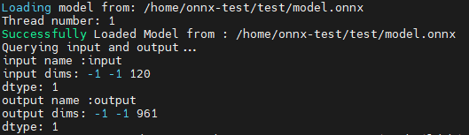

# DFSMN_Onnx
An implementation of DFSMN onnx model using C++

# Environment
Ubuntu Linux 22.04

# Build the project
`mkdir build && cd build`

`cmake .. -DONNXRUNTIME_DIR=/path/to/onnxruntime`

`make`

# Usage
`cd build/bin`

`./query -p /path/to/model.onnx`

`./inference -p /path/to/model.onnx`

# Project Structure is as follows:(under active development)
Onnx

|___ bin

&nbsp;&nbsp;&nbsp;&nbsp;|___ inference.cpp

&nbsp;&nbsp;&nbsp;&nbsp;|___ query.cpp

|___ src

&nbsp;&nbsp;&nbsp;&nbsp;|___ model.cpp

&nbsp;&nbsp;&nbsp;&nbsp;|___ paraformer.cpp

|___ include

&nbsp;&nbsp;&nbsp;&nbsp;|___ inference.h

&nbsp;&nbsp;&nbsp;&nbsp;|___ model.h

&nbsp;&nbsp;&nbsp;&nbsp;|___ paraformer.h

&nbsp;&nbsp;&nbsp;&nbsp;|___ all.h

Right now, inference.cpp serves as a fake inferencing function which constructs a random input of apt size and passes it to the model, getting a fake output.
query.cpp querys on the input and output information of the target onnx model.

Next, we focus on the preprocessing step of the denoising, i.e., how to turn the .wav file into usable tensors of suitable size.

# Updates:
1. 2024/6/3  Add **paraformer** module, a subclass of **Model**, where the initialization of the Ort session takes place. The constructed Onnx model is wrapped within class **Model**. The query of input takes place after initialization.
2. 2024/6/6 Add **QueryWithRandomInput** function which creates a dummy input of suitable size and passes it to the model, getting a fake output.
